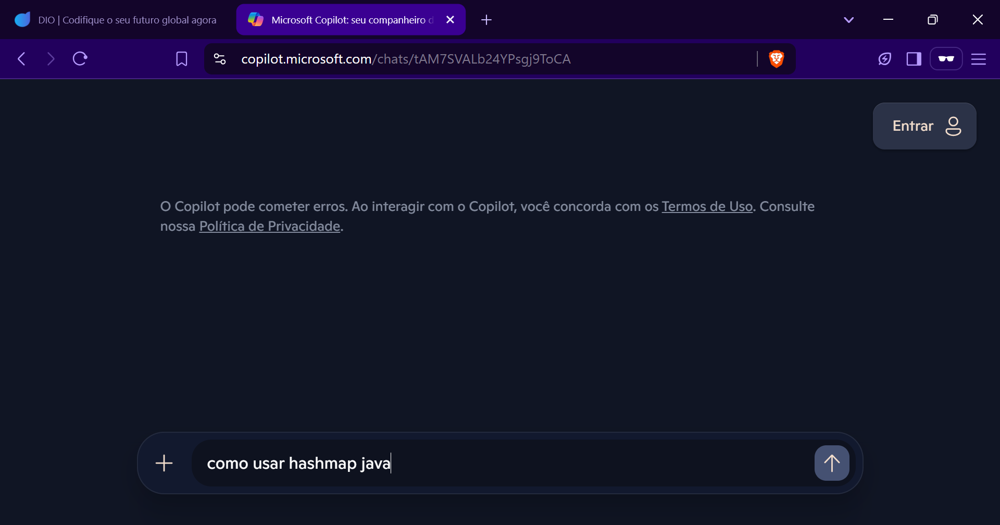
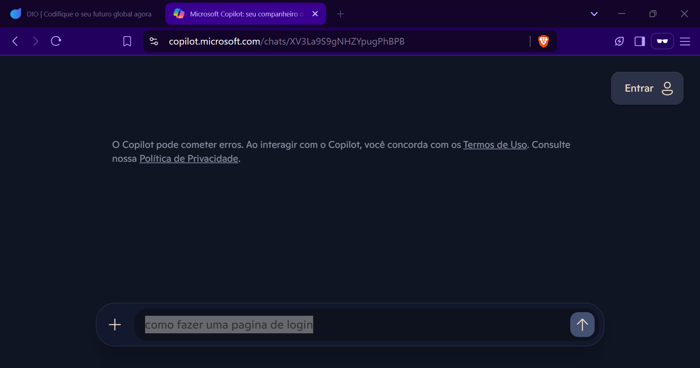
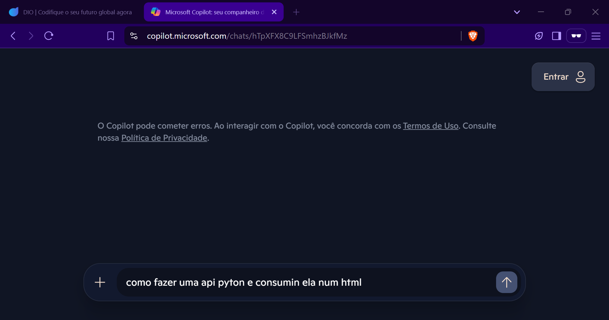

# -Explorando-os-Recursos-de-IA-Generativa-com-Copilot-e-OpenAI-DecolaTec-2025

Chegou a hora de você construir um portfólio ainda mais rico e impressionar futuros recrutadores, para isso é sempre importante mostrar os resultados do seu esforço e como você os obteve deixando claro o seu racional, para isso faça da seguinte maneira:

1. Crie um novo repositório no github com um nome a sua preferência
2. Crie uma pasta chamada 'inputs' e salve as imagens que você utilizou
3. Crie uma pasta chamado 'output' e salve os resultados de reconhecimento de texto nessas imagens
4. Crie um arquivo chamado readme.md , deixe alguns prints descreva o processo, alguns insights e possibilidades que você aprendeu durante o conteúdo.
5. Compartilhe conosco o link desse repositório através do botão 'entregar projeto'

## Experiencia

 Ao inserir um input ele retornou oque foi pedido, tendo a experiencia necessária é possivel utimizar o trabalho, usando a ia para gerar o codigo e só conferindo se há algum erro, mas claro, fazendo uso de uma boa engenharia de prompt, uma entrada mal elaborada resultará numa saida insatisfatória

 ## Imagens solicitadas
 ### como usar hashmap java
 
  
  
  ### como fazer uma pagina de login
  
  
  
  ### como fazer uma api pyton e consumin ela num html
  
  

